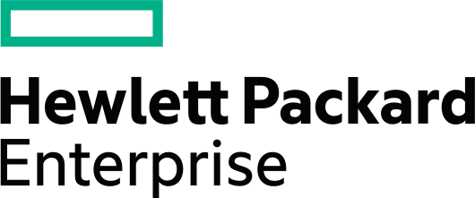

<h1>HPE Aruba Networking Deep Dive Automation with AFC & Python</h1>

# Lab Overview
The HPE Aruba Networking Fabric Composer provides an easy to use graphical user interface. If you would rather use the Rest API's, then this session is just what you need. In this workshop you will deploy a spine/leaf data center network, with python code you are going to write. Data Centers need to operate with minimal human interfaction. They should be highly automated. Upon completion of this workshop you will know to interact with AFC's APIs. 

### Introduction  
There are many different types of API's, or Application Program Interfaces. In this session you will use Rest API's. Rest is an acronym for representational state transfer. It keeps state by passing information in cookies. The AFC has a complete set of Rest API's and you aere going to use them to build your data center network.

The Aruba CX 10000 Series Switch introduces a ground-breaking data center switch category known as Distributed Services Switch (DSS). It combines top-notch Aruba CX data center L2/3 switching capabilities with the industry's pioneering hardware accelerated programmable processor, Pensando P4. This remarkable integration enables stateful firewall services to be delivered inline and at scale, offering wire-rate performance and significant enhancements compared to traditional data center L2/3 switches.  

In this workshop, students will have the opportunity to access two of these innovative switches as top of rack leafs. The two leaf switches will be managed with the HPE Aruba Networking Fabric Composer (AFC), a powerful API-driven, software-defined orchestration solution.

 
### Objective
1. Use Python to drive the Aruba Fabric Composer (AFC) to configure a simple Layer 3 datacenter fabric with Ethernet VPN (EVPN) - Virtual Extensible LAN (VXLAN) and Symmetric Integrated Routing and Bridging (IRB) 
2. Observe the changes in the Aruba Fabric Composer 

